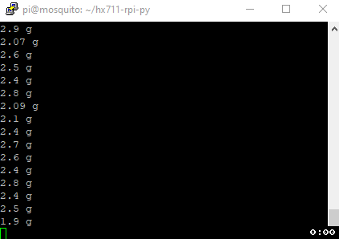

# Raspberry Pi HX711 Python Bindings

Python bindings for [Raspberry Pi HX711 C++ Library](https://github.com/endail/hx711)

- Read from a HX711 using Python
- Use with Raspberry Pi
- Developed and tested with a Raspberry Pi Zero W (should work on other Pis)

## Sample Output



The .gif above illustrates the output of a [simple Python script](src/test.py) on a Raspberry Pi Zero W where the HX711 chip was operating at 80Hz. In this example, each time the `.weight` function is called the median of three samples was used to calculate the weight in grams.

## Examples

### SimpleHX711 Example

```python
from HX711 import *

# create a SimpleHX711 object using GPIO pin 2 as the data pin,
# GPIO pin 3 as the clock pin, -370 as the reference unit, and
# -367471 as the offset
hx = SimpleHX711(2, 3, -370, -367471)

# set the scale to output weights in ounces
hx.setUnit(Mass.Unit.OZ)

# constantly output weights using the median of 35 samples
while True:
    print(hx.weight(35))
```

### AdvancedHX711 Example

```python
from HX711 import *
from datetime import timedelta

# create an AdvancedHX711 object using GPIO pin 2 as the data pin,
# GPIO pin 3 as the clock pin, -370 as the reference unit, -367471
# as the offset, and indicate that the chip is operating at 80Hz
hx = AdvancedHX711(2, 3, -370, -367471, Rate.HZ_80)

# constantly output weights using the median of all samples
# obtained within 1 second
while True:
    print(hx.weight(timedelta(seconds=1)))
```

## Build

```console
# Step 1: clone this repository
pi@raspberrypi:~ $ git clone https://github.com/endail/hx711-rpi-py
pi@raspberrypi:~ $ cd hx711-rpi-py

# Step 2: install liblgpio and libhx711 dependencies
pi@raspberrypi:~/hx711-rpi-py $ sudo ./install-deps

# Step 3: build (this may take some time)
pi@raspberrypi:~/hx711-rpi-py $ make

# bin directory will contain python module
# eg. HX711.cpython-37m-arm-linux-gnueabihf.so
# import this file into your Python script as in examples above
```

## Documentation

As the Python code relies upon the [underlying C++ library](https://github.com/endail/hx711#documentation), the documentation is identical. However, not all of the code is exposed to Python. An example is the [Utility class](https://github.com/endail/hx711/blob/master/include/Utility.h), which is only meant for use within the C++ library. You can check precisely which functionality is accessible through Python in the [bindings.cpp file](src/bindings.cpp).
